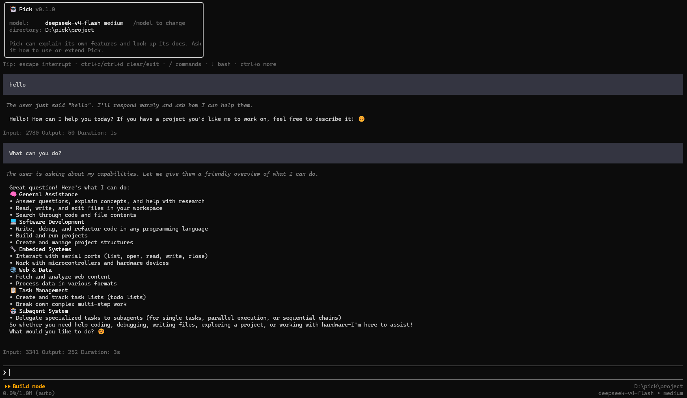

[中文文档](README.zh-CN.md)



# Pick

**Pick** is an AI coding assistant that runs in your terminal. It connects to multiple LLM providers (Anthropic, OpenAI, Google, Mistral, Bedrock, etc.), understands your codebase, and can read, write, edit files, run commands, search code, and more — all through natural language conversation.

A Rust port of the pi AI coding agent, combining high performance with reliability.

## Features

- **Multi-provider LLM** — Anthropic, OpenAI, Google, Mistral, Bedrock, Azure OpenAI, DeepSeek, Kimi, MiniMax, ZAI, Cloudflare, GitHub Copilot, Google Vertex
- **5 run modes** — TUI (default), Interactive (REPL), Print/JSON (batch), RPC (JSON-RPC over stdio), Server (web UI)
- **Agent tool system** — read, write, edit, bash, grep, find, ls, webfetch
- **Extensions** — dynamic library loading via lifecycle hooks
- **MCP support** — Model Context Protocol servers for extending tool capabilities
- **Session management** — JSONL-based persistence, fork/resume, compaction, branch summarization
- **Plan / Build modes** — Read-only planning phase before making changes
- **Sandbox isolation** — Windows restricted tokens, Linux bubblewrap, macOS Seatbelt
- **Permission system** — Granular allow/deny/ask rules with audit trail
- **Custom TUI** — Differential rendering, markdown, syntax highlighting, image display, undo/redo
- **Skills & prompt templates** — Reusable instructions and system prompts
- **Themes** — Customizable terminal UI themes
- **Two-tier settings** — Global `~/.pick/settings.json` merged with project `.pick/settings.json`
- **Auto-update** — Built-in update mechanism via `pick update`
- **Session export** — Export conversations to HTML
- **Cross-platform** — Terminal CLI/TUI (Windows, Linux, macOS), Desktop GUI (Windows, Linux, macOS), Web, Mobile (Android, iOS)
- **Web & Desktop GUI** — React-based web interface served by built-in HTTP server; Tauri desktop wrapper for native experience
- **Mobile support** — Android and iOS apps via Tauri

## Architecture

```text
pick-tui (terminal UI, no pick deps)
pick-ai  (LLM abstraction, no pick deps)
    ↑
pick-agent (depends on pick-ai, pick-tui)
    ↑
├── pick-cli — Binary entrypoint, produces `pick`
├── pick-mcp — MCP protocol client
├── pick-sandbox — Process isolation
├── pick-server — HTTP/WS server for web UI
    ↑
└── pick-desktop — Tauri app (desktop GUI + mobile)
```

- **pick-ai** — Unified multi-provider LLM abstraction with provider registry pattern
- **pick-agent** — Agent loop, tool system, session/JSONL storage, extension loader
- **pick-tui** — Crossterm-based terminal UI with custom differential rendering engine
- **pick-cli** — CLI binary, argument parsing, settings, auth, all run modes
- **pick-mcp** — Model Context Protocol client (stdio, SSE, streamable HTTP)
- **pick-sandbox** — Platform-specific process isolation (Windows Job Objects, Linux bwrap, macOS Seatbelt)
- **pick-server** — Axum-based HTTP/WS server, serves web frontend and provides WebSocket API
- **pick-desktop** — Tauri 2.0 wrapper for desktop (Windows, Linux, macOS) and mobile (Android, iOS)

## Platforms

Pick is available on multiple platforms with different interfaces:

| Interface | Technology | Supported Targets |
|-----------|-----------|-------------------|
| **Terminal** | CLI / TUI (crossterm + ratatui) | Windows, Linux, macOS |
| **Desktop** | Tauri GUI (React frontend) | Windows, Linux, macOS |
| **Web** | Browser (Vite + React + pick-server) | Any modern browser |
| **Mobile** | Tauri app (React frontend) | Android, iOS |

The terminal CLI/TUI is the primary interface. Desktop, web, and mobile use the same core `pick-agent` engine through a built-in HTTP/WS server (`pick-server`), with a React frontend.

## Installation

### npm (requires Node.js >= 16)

```bash
npm install -g @vividcodeai/pick
```

> npm installation automatically downloads the correct platform binary for your system.

### Linux / macOS

```bash
curl -fsSL https://github.com/vividcode-ai/pick/releases/latest/download/install.sh | sh
```

### Windows (PowerShell)

```powershell
irm https://github.com/vividcode-ai/pick/releases/latest/download/install.ps1 | iex
```

### From source

```bash
git clone https://github.com/vividcode-ai/pick.git
cd pick
cargo build --release
./target/release/pick --help
```

## Quick Start

```bash
# Start TUI (default mode)
pick

# Start with a specific model and provider
pick -m claude-sonnet-4-20250514 -p anthropic

# One-shot question (print mode)
pick -P "What does this project do?"

# Interactive REPL mode
pick --mode interactive

# Resume a previous session
pick -s <session-id>

# List available models
pick --list-models

# Plan mode (read-only research before making changes)
pick --agent-mode plan -P "How should I refactor this?"

# Start web server with browser UI
pick server --open
```

## Documentation

See [docs/](docs/README.md) for in-depth documentation:

| Document | Description |
|----------|-------------|
| [Quickstart](docs/quickstart.md) | Installation and first steps |
| [CLI Reference](docs/cli.md) | Command-line options reference |
| [Architecture](docs/architecture.md) | Project structure and crate overview |
| [Extensions](docs/extensions.md) | Extension system and lifecycle hooks |
| [Skills](docs/skills.md) | Reusable instruction files |
| [Permissions](docs/permissions.md) | Access control and audit system |
| [MCP](docs/mcp.md) | Model Context Protocol server setup |
| [Settings](docs/settings.md) | Configuration reference |

## Configuration

Settings are stored in two tiers:

- **Global**: `~/.pick/settings.json`
- **Project**: `.pick/settings.json` (project-local, overrides global)

Example `.pick/settings.json`:

```json
{
  "default_provider": "anthropic",
  "default_model": "claude-sonnet-4-20250514",
  "permission": {
    "approval_policy": "on_request",
    "permission_profile": ":workspace"
  }
}
```

## CLI Options

| Flag | Description |
|------|-------------|
| `-m, --model` | Model to use |
| `-p, --provider` | LLM provider |
| `-s, --session` | Resume session by ID |
| `-r, --resume` | Interactive session selector |
| `--fork <ID>` | Fork a session |
| `--mode` | Run mode: tui, interactive, print, json, rpc |
| `--thinking <LEVEL>` | Thinking level: off, minimal, low, medium, high, xhigh |
| `-P, --print` | Print mode (batch) |
| `-e, --extension` | Load extension |
| `--skill` | Load skill |
| `--agent-mode` | build or plan |
| `--list-models` | List available models |
| `--export <FILE>` | Export session to HTML |
| `server` | Start web server with browser UI (subcommand) |
| `--port <PORT>` | Server port (default: random available) |
| `--host <HOST>` | Server host address (default: 127.0.0.1) |
| `--open` | Open browser automatically on server start |
| `--audit` | View permission audit trail |

## Pros & Cons

**Pros:**
- Fast, native performance (Rust)
- Wide LLM provider support
- Multiple interfaces: terminal, desktop GUI, web, mobile
- Rich TUI with markdown, images, syntax highlighting
- Session persistence with compaction
- Plan mode prevents accidental changes
- Extensible via dynamic libraries and MCP
- Built-in sandboxing for command execution
- Granular permission control

**Cons:**
- Younger project, smaller community
- Documentation still growing
- Some features (e.g., sandbox on macOS) require platform-specific setup
- Mobile and web platforms are still maturing

## License

MIT
