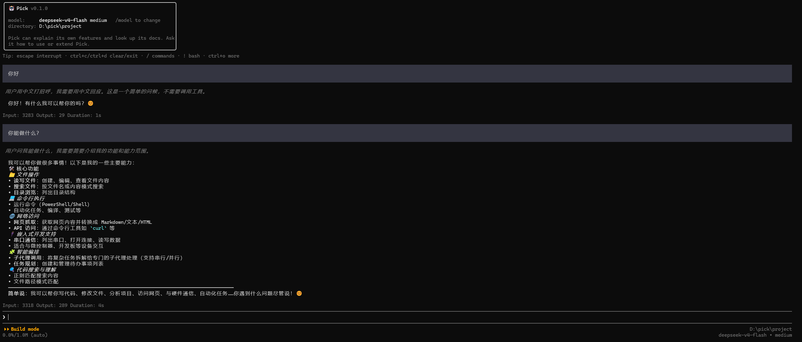

[English](README.md)



# Pick

**Pick** 是一款运行在终端中的 AI 编程助手。它支持接入多种 LLM 提供商（Anthropic、OpenAI、Google、Mistral、Bedrock 等），能够理解你的代码仓库，并通过自然语言对话完成文件读写、代码编辑、命令执行、代码搜索等任务。

基于pi重构为 Rust版本，兼具高性能和高可靠性。

## 特性

- **多提供商 LLM** — Anthropic、OpenAI、Google、Mistral、Bedrock、Azure OpenAI、Cloudflare、GitHub Copilot、Google Vertex
- **4 种运行模式** — TUI（默认）、交互式 REPL、Print/JSON 批处理、RPC（基于 stdio 的 JSON-RPC）
- **智能体工具系统** — read、write、edit、bash、grep、find、ls、webfetch
- **扩展机制** — 通过动态库加载的生命周期钩子
- **MCP 支持** — 模型上下文协议服务器，扩展工具能力
- **会话管理** — JSONL 持久化存储、fork/resume、压缩、分支摘要
- **计划/构建模式** — 只读计划阶段，确认后再执行变更
- **沙箱隔离** — Windows 受限令牌、Linux bubblewrap、macOS Seatbelt
- **权限系统** — 精细的 allow/deny/ask 规则，完整审计日志
- **自定义 TUI** — 差分渲染、Markdown、语法高亮、图片显示、撤销/重做
- **技能与提示词模板** — 可复用的指令和系统提示词
- **主题** — 可定制的终端 UI 主题
- **双层配置** — 全局 `~/.pick/settings.json` 与项目 `.pick/settings.json` 自动合并
- **自动更新** — 内置 `pick update` 更新机制
- **会话导出** — 将对话导出为 HTML
- **跨平台** — Windows、macOS、Linux

## 架构

```text
pick-tui（不依赖其他 pick crate）
    ↑
pick-ai（不依赖其他 pick crate）
    ↑
pick-agent（依赖 pick-ai 和 pick-tui）
    ↑
pick-cli（二进制入口，依赖所有 crate）— 生成 `pick` 可执行文件
pick-mcp（MCP 协议实现）
pick-sandbox（进程隔离实现）
```

- **pick-ai** — 统一的多提供商 LLM 抽象层，基于提供者注册模式
- **pick-agent** — 智能体主循环、工具系统、会话/JSONL 存储、扩展加载器
- **pick-tui** — 基于 crossterm 的终端 UI，自定义差分渲染引擎
- **pick-cli** — CLI 二进制入口、参数解析、设置、认证、所有运行模式
- **pick-mcp** — 模型上下文协议客户端（stdio、SSE、streamable HTTP）
- **pick-sandbox** — 平台特定的进程隔离（Windows Job Objects、Linux bwrap、macOS Seatbelt）

## 安装

### npm 安装（需要 Node.js >= 16）

```bash
npm install -g @vividcodeai/pick
```

> npm 安装会自动下载您系统对应的平台二进制文件。
### Linux / macOS

```bash
curl -fsSL https://github.com/vividcode-ai/pick/releases/latest/download/install.sh | sh
```

### Windows (PowerShell)

```powershell
irm https://github.com/vividcode-ai/pick/releases/latest/download/install.ps1 | iex
```

### 从源码编译

```bash
git clone https://github.com/vividcode-ai/pick.git
cd pick
cargo build --release
./target/release/pick --help
```

## 快速开始

```bash
# 启动 TUI 模式（默认）
pick

# 指定模型和提供商启动
pick -m claude-sonnet-4-20250514 -p anthropic

# 单次问答（print 模式）
pick -P "这个项目是做什么的？"

# 交互式 REPL 模式
pick --mode interactive

# 恢复之前的会话
pick -s <session-id>

# 列出可用模型
pick --list-models

# 计划模式（只读调研，确认后再实施变更）
pick --agent-mode plan -P "这个模块应该如何重构？"
```

## 配置

配置文件分为两层：

- **全局配置**：`~/.pick/settings.json`
- **项目配置**：`.pick/settings.json`（覆盖全局配置）

`.pick/settings.json` 示例：

```json
{
  "default_provider": "anthropic",
  "default_model": "claude-sonnet-4-20250514",
  "permission": {
    "approval_policy": "on_request",
    "permission_profile": ":workspace"
  }
}
```

## CLI 选项

| 参数 | 说明 |
|------|------|
| `-m, --model` | 指定模型 |
| `-p, --provider` | 指定 LLM 提供商 |
| `-s, --session` | 按 ID 恢复会话 |
| `-r, --resume` | 交互式会话选择器 |
| `--fork <ID>` | 复制会话 |
| `--mode` | 运行模式：tui、interactive、print、json、rpc |
| `--thinking <LEVEL>` | 思考级别：off、minimal、low、medium、high、xhigh |
| `-P, --print` | Print 模式（批处理） |
| `-e, --extension` | 加载扩展 |
| `--skill` | 加载技能 |
| `--agent-mode` | build 或 plan |
| `--list-models` | 列出可用模型 |
| `--export <FILE>` | 将会话导出为 HTML |
| `--audit` | 查看权限审计日志 |

## 优缺点

**优点：**
- 原生 Rust 实现，性能优异
- 广泛支持各类 LLM 提供商
- 功能丰富的 TUI，支持 Markdown、图片、语法高亮
- 会话持久化存储与压缩
- 计划模式防止意外变更
- 支持动态库和 MCP 扩展
- 内置沙箱机制隔离命令执行
- 细粒度的权限控制

**缺点：**
- 项目尚年轻，社区规模较小
- 文档仍在完善中
- 部分功能（如 macOS 沙箱）需要特定平台配置

## 许可证

MIT
